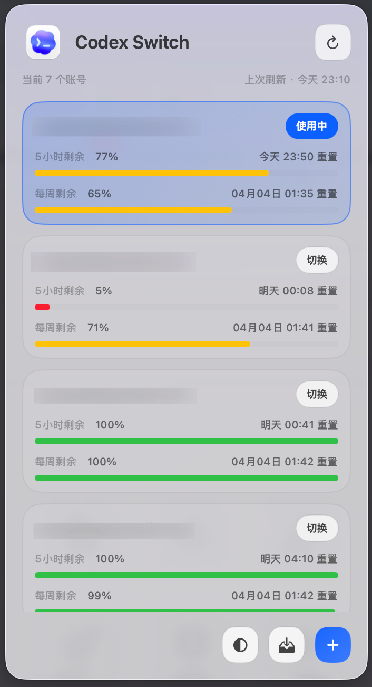
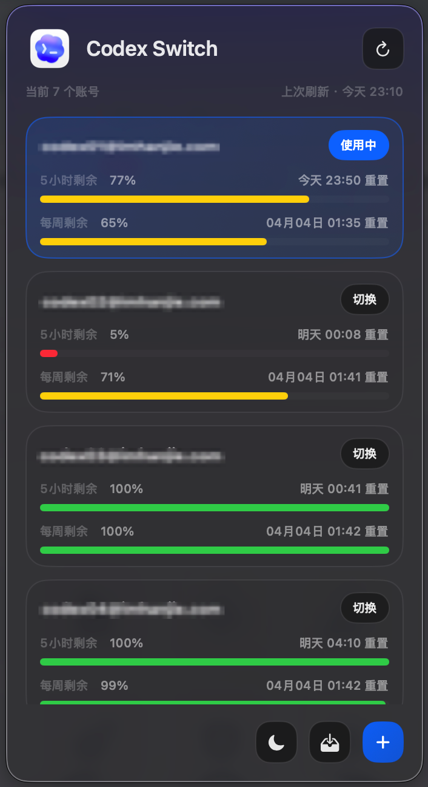

# Codex Switch

一个面向 macOS 的 Codex 多账号切换菜单栏工具。

它会读取当前本机的 Codex 登录态，支持收录多个 ChatGPT 账号快照，在菜单栏里快速切换账号，并展示 5 小时窗口与每周窗口的剩余额度。

## 截图

<p align="center">
  
  
</p>

## 功能特性

- 菜单栏常驻，快速查看当前已管理的 Codex 账号
- 一键收录当前 `live` 账号为可切换快照
- 直接调用 `codex login` 登录新账号并纳入管理
- 在多个账号之间切换当前生效的 `auth.json`
- 展示 5 小时窗口和每周窗口的剩余额度与重置时间
- 支持浅色、深色、跟随系统三种主题模式
- 自动同步当前 live 登录态，避免已管理账号信息漂移

## 适用场景

- 你有多个 Codex / ChatGPT 账号，需要频繁切换
- 你希望在切号前先看各账号的剩余额度
- 你不想手动备份和覆盖 `~/.codex/auth.json`

## 环境要求

- macOS 13 或更高版本
- 已安装 Xcode
- 已安装 `codex` CLI，并至少完成过一次登录

> 当前只支持 ChatGPT 登录态，不支持 API Key 模式。

## 安装与运行

### 用 Xcode 运行

1. 打开 `codex-switch.xcodeproj`
2. 选择 `codex-switch` Scheme
3. `Run` 即可启动菜单栏应用

### 命令行检查

```bash
xcodebuild -project codex-switch.xcodeproj -scheme codex-switch
swift test
```

## 使用说明

1. 启动应用后，点击菜单栏中的 Codex Switch 图标
2. 如果当前机器已经有可用的 Codex 登录态，可以先点“收录当前账号”
3. 点击右下角 `+` 可发起一次新的 `codex login`
4. 选择任意已管理账号并点击“切换”，应用会把对应快照写回 `~/.codex/auth.json`
5. 切换完成后，请自行重启 Codex App、Codex CLI、Codex IDE 插件，确保新登录态生效

## 数据存储

应用会使用以下本地数据：

- `~/.codex/auth.json`：当前 live 登录态
- `~/Library/Application Support/com.imhanjie.codex-switch/`：账号快照、注册表、使用量缓存、备份文件

账号切换的本质是安全地管理和替换本地 `auth.json`。如果你使用系统同步盘或备份工具，请注意不要把这些敏感文件同步到不可信环境。

## 开发说明

- Swift tools: 6.0
- Xcode 工程：`codex-switch.xcodeproj`
- Swift Package 测试入口：`Package.swift`

本地已验证：

- `swift test` 通过，共 27 个测试

## 项目结构

```text
codex-switch/
├── App/        # AppKit 菜单栏宿主、浮层与状态栏控制
├── Core/       # 账号快照、auth 解析、切换与额度查询逻辑
├── UI/         # 菜单栏面板视图与 ViewModel
├── Resources/  # 应用图标等资源
Tests/          # Core 与菜单栏逻辑测试
```

## 注意事项

- 本项目会读写本机 Codex 登录文件，请在了解其行为后使用
- 删除账号仅删除本应用保存的快照，不会主动注销远端账号
- 如果本机未安装 `codex` 命令，“登录新账号”功能将不可用

## License

如果你准备公开仓库，建议补充一个明确的 License 文件，例如 MIT。
